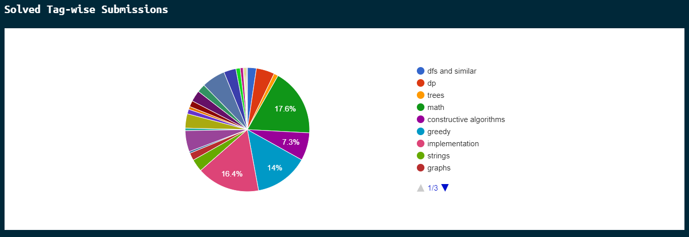
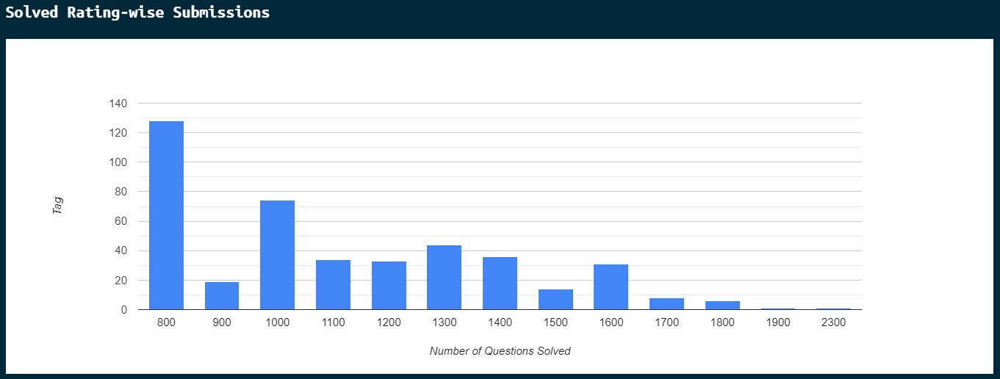
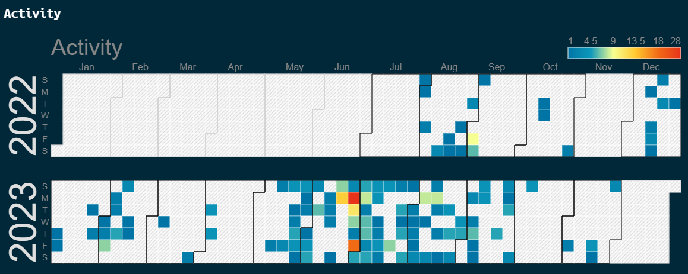

# Codeforces Dashboard

This is a Codeforces dashboard application that allows users to track their Codeforces submissions and visualize their performance.

## Features

- **User Details:** Enter your Codeforces handle to view details such as current rating and max rating.

- **Solved Tag-wise Submissions:** See a pie chart showcasing the distribution of your solved problems based on tags.

- **Solved Rating-wise Submissions:** Explore a column chart displaying the count of questions solved at different difficulty ratings.

- **Activity Calendar:** Visualize your coding activity with a dynamic calendar chart, highlighting the days you solved problems.

## Technologies Used

- **Frontend:** React with Vite

- **Backend:** Node.js, Express

- **Data Fetching:** Axios

- **CORS Handling:** Cors middleware

## Installation and Setup

1. Clone the repository:

   ```bash
   git clone https://github.com/your-username/codeforces-dashboard.git

2. Navigate to the project directory:

    ```bash
    cd codeforces-dashboard

3. Install dependencies:

    ```bash
    npm install

4. Start the frontend and backend servers:

  For frontend:
    ```bash
    npm run dev
    
  For backend:
    ```bash
    node server.js

## Usage
- Enter your Codeforces handle in the form and submit.

- Explore different charts to analyze your Codeforces submissions.

- View the activity calendar to see your coding progress over time.

## Screenshots





